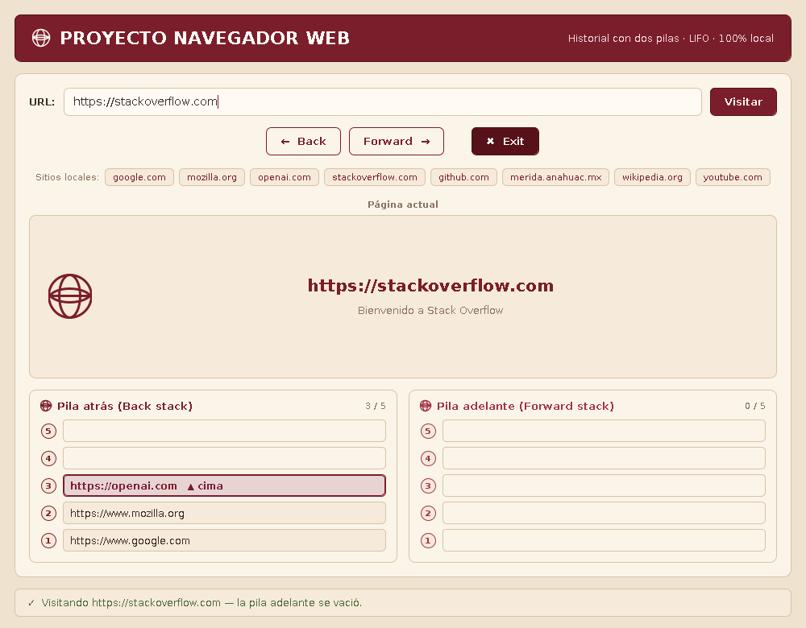
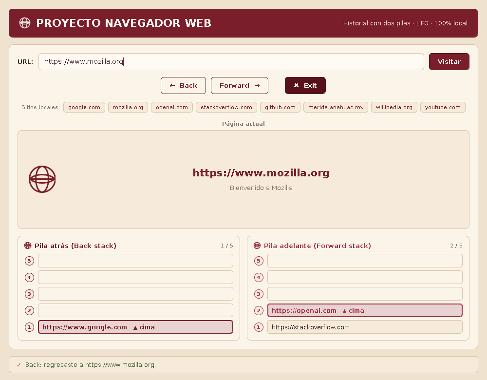
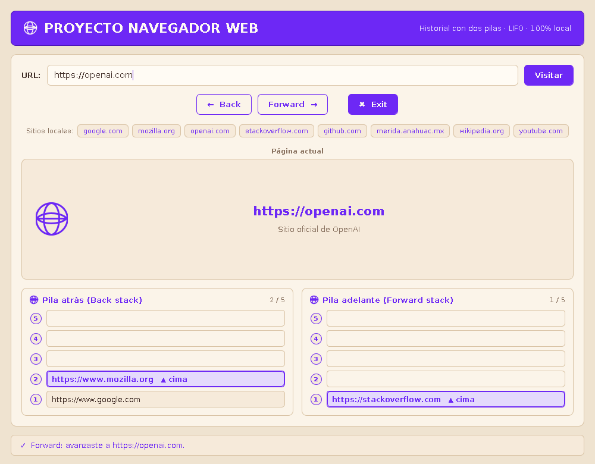
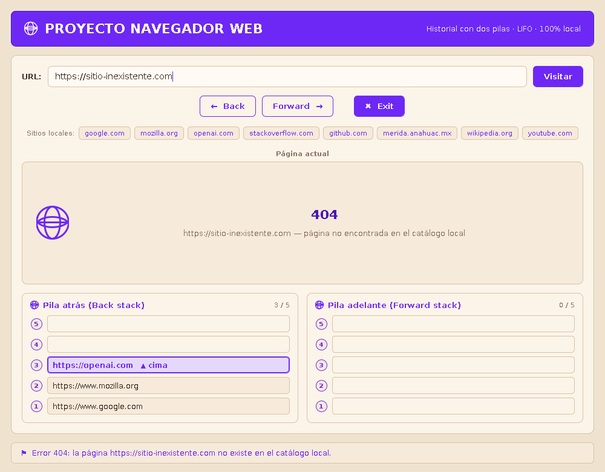
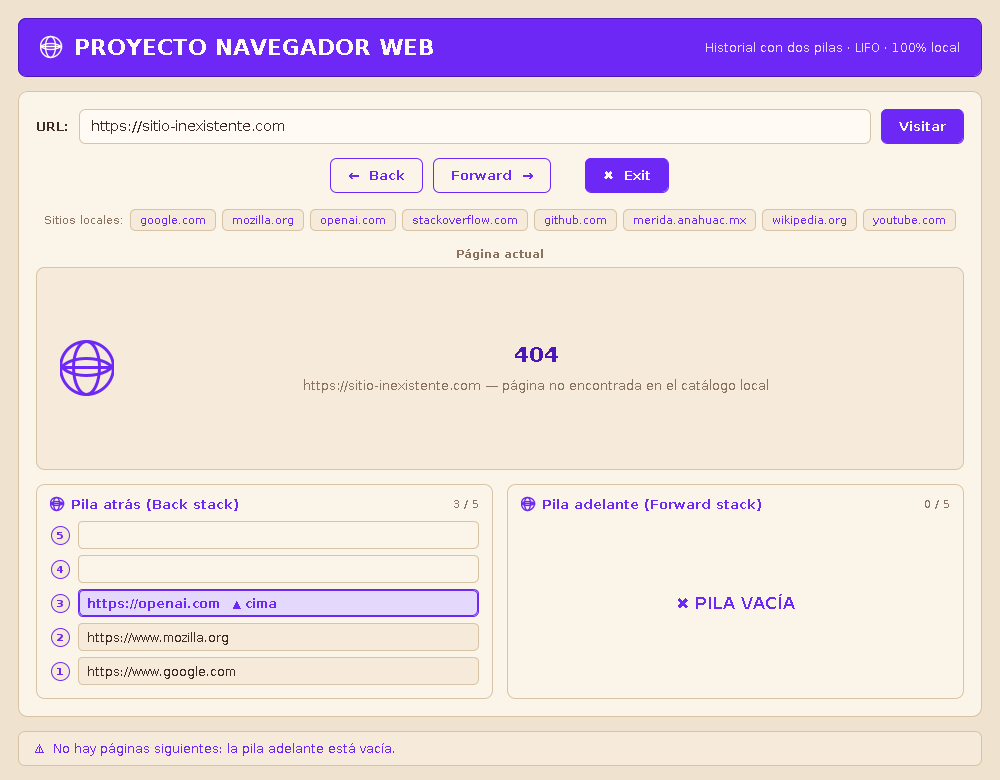
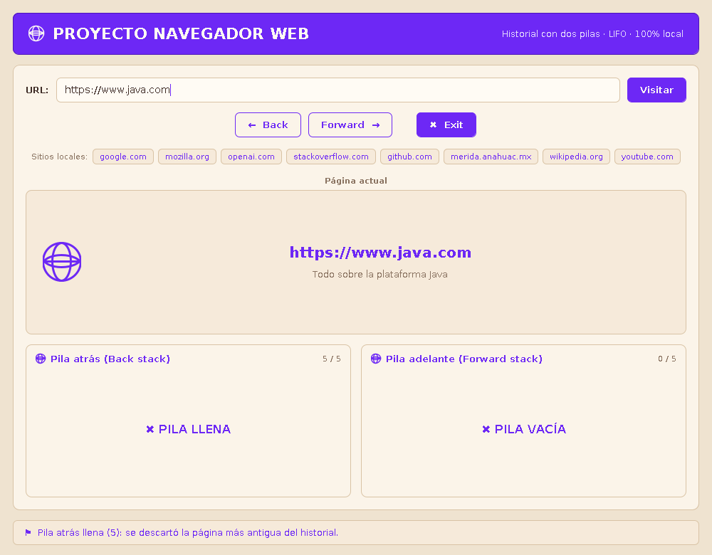

# Navegador Web con Pilas (LIFO) — Proyecto E5

Aplicación de escritorio en **Java (Swing)** que simula el funcionamiento básico de un
navegador web. Todo el historial se administra con la estructura de datos **Pila (Stack)**:

- **Pila atrás (Back stack):** almacena las páginas visitadas anteriormente.
- **Pila adelante (Forward stack):** almacena las páginas a las que se puede avanzar
  después de haber retrocedido.

El proyecto es **100 % local**: no realiza ninguna conexión a internet, las páginas se
simulan con un catálogo interno y cualquier URL desconocida produce un **error 404**.



> **¿Necesitas entender el código?** En [`EXPLICACION.md`](EXPLICACION.md) está el
> desglose completo: fase por fase, clase por clase y método por método.

## Reglas de navegación implementadas

| Acción | Qué ocurre |
|---|---|
| **Visitar** una página nueva | La página actual se apila en la **pila atrás**, la nueva pasa a ser la actual y la **pila adelante se vacía**. |
| **Back** | La página actual se apila en la **pila adelante** y la cima de la **pila atrás** se convierte en la página actual. |
| **Forward** | La página actual se apila en la **pila atrás** y la cima de la **pila adelante** se convierte en la página actual. |
| **Exit** | Pide confirmación y cierra el navegador. |

Casos especiales, siempre con mensajes claros y sin que el programa falle:

- Back con la pila atrás vacía → aviso **PILA VACÍA** y no se modifica nada.
- Forward con la pila adelante vacía → aviso **PILA VACÍA** y no se modifica nada.
- Pila llena (capacidad 5) → aviso **PILA LLENA**; se descarta la página más antigua
  (el fondo de la pila) para poder guardar la más reciente.
- URL que no existe en el catálogo local → se muestra la página **404**.
- Campo de URL vacío → mensaje pidiendo escribir una dirección.

| Back | Forward | 404 |
|---|---|---|
|  |  |  |

| Pila vacía | Pila llena |
|---|---|
|  |  |

## Cómo ejecutar

Requisito: **JDK 8 o superior** (probado con JDK 21).

Primero clona el repositorio y entra a la carpeta; el script vive dentro del proyecto:

```bash
git clone -b claude/explicacion-codigo https://github.com/diegoanahuac/Navegador_Web_E5.git
cd Navegador_Web_E5
```

Y ya dentro de la carpeta:

Linux / macOS:

```bash
./ejecutar.sh              # interfaz gráfica
./ejecutar.sh --consola    # versión de consola con menú
```

Windows (en PowerShell hay que anteponer `.\`):

```powershell
.\ejecutar.bat
.\ejecutar.bat --consola
```

Manualmente:

```bash
javac -encoding UTF-8 -d out src/navegador/*.java src/navegador/*/*.java
java -cp out navegador.Main
```

## Uso de la interfaz

1. Escribe una URL en la barra de direcciones (o haz clic en uno de los *chips* de
   **Sitios locales**) y presiona **Visitar** o la tecla **Enter**.
2. Usa **← Back** y **Forward →** para moverte por el historial
   (atajos: `Alt + ←` y `Alt + →`).
3. Las dos pilas se dibujan abajo: la casilla **1** es el fondo de la pila y la casilla
   marcada con **▲ cima** es el siguiente elemento que saldría.
4. **✖ Exit** cierra la aplicación.

Sitios disponibles en el catálogo local: `google.com`, `mozilla.org`, `openai.com`,
`stackoverflow.com`, `github.com`, `merida.anahuac.mx`, `wikipedia.org`, `youtube.com`,
`java.com`.

## Tema visual

La interfaz usa una base **beige** y un **único color de acento violeta neón**
(`#6D28F5`), definido en `ui/Paleta.java`. Toda la aplicación —encabezado, botones,
bordes, números de las casillas, avisos y mensajes de estado— usa ese mismo tono;
`ACENTO_PROFUNDO` y `ACENTO_TENUE` son el mismo color más oscuro (solo para el
*hover* de los botones) y más claro (relleno de la cima). Para cambiar todo el
tema basta con modificar esas tres constantes.

## Estructura del proyecto

```
src/navegador/
├── Main.java                      Punto de entrada (gráfico o --consola)
├── modelo/
│   ├── Pila.java                  Pila genérica LIFO de capacidad fija (arreglo)
│   ├── Pagina.java                Página simulada (URL, título, descripción, 404)
│   ├── CatalogoLocal.java         Sitios locales y normalización de URLs
│   ├── Resultado.java             Mensaje y aviso devueltos por cada operación
│   └── Navegador.java             Lógica del historial con las dos pilas
├── ui/
│   ├── VentanaNavegador.java      Ventana principal
│   ├── PanelPaginaActual.java     Tarjeta de la página actual / 404
│   ├── PanelPila.java             Dibujo de una pila y sus avisos
│   ├── Paleta.java                Color: base beige + un único acento violeta
│   ├── PanelRedondeado.java       Panel con esquinas redondeadas
│   ├── BotonPlano.java            Botón plano redondeado
│   └── IconoGlobo.java            Icono de globo dibujado en código
└── consola/
    └── NavegadorConsola.java      Versión de consola con menú (misma lógica)
```

La clase `Pila` es propia (no usa `java.util.Stack`) e implementa las operaciones
clásicas: `apilar`, `desapilar`, `cima`, `estaVacia`, `estaLlena`, `tamano` y `vaciar`,
más `apilarConDescarte` para el manejo del desbordamiento.
